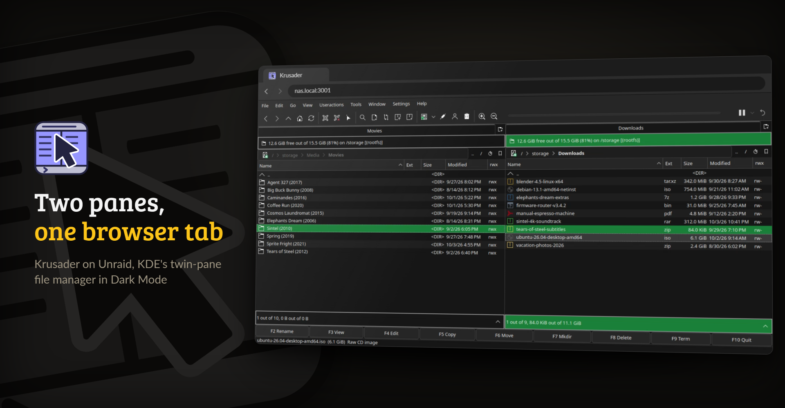
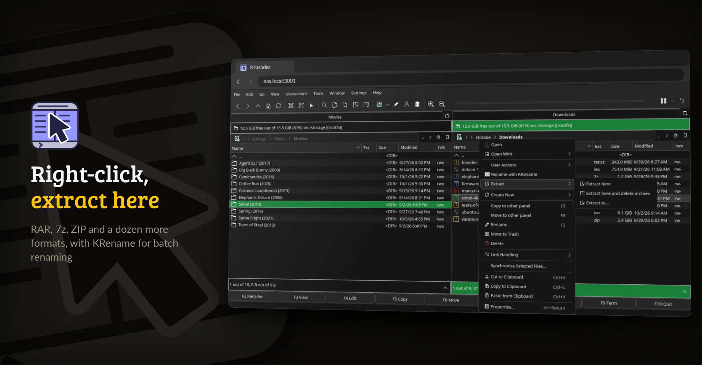

<p align="center">
  <picture>
    <source media="(prefers-color-scheme: dark)" srcset="https://raw.githubusercontent.com/junkerderprovinz/krusader/main/.github/assets/krusader-banner-dark.png">
    
  </picture>
</p>

<p align="center">
  <a href="https://github.com/junkerderprovinz/krusader/actions/workflows/build.yml"></a>&nbsp;
  <a href="https://github.com/junkerderprovinz/krusader/actions/workflows/lint.yml"></a>&nbsp;
  <a href="https://hub.docker.com/r/junkerderprovinz/krusader"></a>&nbsp;
  <a href="https://hub.docker.com/r/junkerderprovinz/krusader"></a>&nbsp;
  <a href="https://github.com/junkerderprovinz/krusader/pkgs/container/krusader"></a>&nbsp;
  <a href="https://github.com/selkies-project/selkies"></a>&nbsp;
  <a href="#2-what-it-does"></a>&nbsp;
  <a href="https://unraid.net"></a>&nbsp;
  <a href="LICENSE"></a>
</p>

<br>

<p align="center">
A modern, plug-and-play Docker image for <b>Krusader</b> on Unraid. Twin-pane file
management in your browser, powered by Selkies, with Dark Mode, Kate as
external editor, full archive support and 33 UI languages, all configurable
from the Unraid template, no SSH or config-file editing required.
</p>

<!-- download-buttons: written by scripts/gen_download_buttons.py -->
<p align="center">
  <a href="https://ca.unraid.net/apps/krusader-1gjxcb9125o7ip"></a>
  &nbsp;
  <a href="https://hub.docker.com/r/junkerderprovinz/krusader/"></a>
  &nbsp;
  <a href="https://github.com/junkerderprovinz/krusader/releases/latest"></a>
</p>
<!-- /download-buttons -->

<br>

<p align="center">
A one-knight job: I build it, keep it running, work through the issues and add what people ask for, until nothing is missing. It is free, with no accounts, no telemetry, no ads and no paid tier. No asterisk anywhere. Nothing readable ever leaves your own walls. Forged on evenings and weekends, with heart and stubbornness.
</p>

<p align="center">
If it has earned a place on your server or computer, toss a coin to your knight: it helps cover the costs and keeps the project alive. It also makes this knight's heart beat a little faster. Three ways below, whichever suits you.
</p>

<!-- give-buttons: written by scripts/gen_download_buttons.py -->
<p align="center">
  <a href="https://buymeacoffee.com/junkerderprovinz"></a>
  &nbsp;
  <a href="https://www.paypal.com/donate/?hosted_button_id=76FVV52TKXTUS"></a>
  &nbsp;
  <a href="https://junkerderprovinz.github.io/junkerderprovinz/"></a>
</p>
<!-- /give-buttons -->

<br>

## Table of Contents

1. [What it looks like](#1-what-it-looks-like)
2. [What it does](#2-what-it-does)
3. [How it compares](#3-how-it-compares)
4. [Getting started](#4-getting-started)
5. [How AI is used here](#5-how-ai-is-used-here)
6. [Support this project](#6-support-this-project)

<br>

## 1. What it looks like

The files and folders in these pictures are made up.

<p align="center">
  
  <br><em>Two panes side by side in Dark Mode, streamed to any browser on your network</em>
</p>

<p align="center">
  
  <br><em>The right-click menu on an archive: extract it, rename in bulk with KRename, copy it to the other pane</em>
</p>

<br>

## 2. What it does

- **Selkies instead of noVNC.** H.264 video for a smooth desktop at 60 fps, a real clipboard in both directions, and file upload and download from the browser.
- **Dark Mode** for Krusader, Kate and the rest of KDE. One variable switches to light.
- **Icons that follow the row colour.** Krusader is built from source with a patch that tints each file icon in its row's text colour, so icons stay readable on any highlight.
- **Kate, KRename and Kompare included.** Kate is the editor behind F4, KRename renames hundreds of files at once, and File → Compare by Content opens a real diff.
- **Archives out of the box:** RAR, 7z, ZIP, TAR, GZ, BZ2, XZ and more, with Extract RAR here in the right-click menu.
- **33 languages**, picked from a dropdown in the Unraid template.
- **The desktop follows your browser window**, so there is no screen size to set, and quitting Krusader starts a fresh one instead of leaving a black screen.
- **Your settings survive updates**, and the image runs on amd64 and arm64.

<br>

## 3. How it compares

| | **This image** | binhex | jlesage | ich777 |
|---|:---:|:---:|:---:|:---:|
| Web stack | **Selkies** | noVNC | noVNC | noVNC |
| HW-accelerated rendering | ✅ | ❌ | ❌ | ❌ |
| Browser clipboard | ✅ | ⚠️ | ⚠️ | ⚠️ |
| File upload via WebUI | ✅ | ❌ | ❌ | ❌ |
| Dark Mode default | ✅ | ❌ | ❌ | ❌ |
| Kate as editor | ✅ | ❌ | ❌ | ❌ |
| Batch rename (krename) | ✅ | ❌ | ❌ | ❌ |
| RAR right-click | ✅ | ❌ | ❌ | ❌ |
| Language dropdown | ✅ (33) | ❌ | ❌ | ❌ |
| Multi-arch | ✅ amd64 + arm64 | amd64 | ✅ | amd64 |
| Base | LinuxServer | binhex/Arch | jlesage/Alpine | ich777/Debian |

<br>

## 4. Getting started

On Unraid, install Krusader from [Community Applications](https://ca.unraid.net/apps/krusader-1gjxcb9125o7ip). The defaults work as they are. Check the storage path (`/mnt` by default, which shows every share and disk), the language and the theme, and set a WebUI password if the server can be reached from outside your network. The first start takes 30 to 60 seconds.

Then open `https://<server-ip>:3001/` and accept the self-signed certificate once. The Selkies client needs HTTPS. Port `3000` is plain HTTP and only works behind a reverse proxy that handles TLS.

Without Unraid:

```bash
docker run -d --name krusader --shm-size=1gb \
  -p 3001:3001 \
  -e PUID=99 -e PGID=100 -e KRUSADER_LANG=en \
  -v /path/to/appdata/krusader:/config \
  -v /mnt:/storage \
  junkerderprovinz/krusader:latest
```

`--shm-size=1gb` keeps KDE rendering smooth; the Unraid template sets it for you. Known problems and their fixes are in [TROUBLESHOOTING.md](TROUBLESHOOTING.md).

<br>

## 5. How AI is used here

One knight builds this, and AI is one of the tools I work with, the same way I work with an editor or a compiler. It helps me write code and documentation and it checks my work, and that saves me a good many evenings. It does not make the decisions, though. I read and understand everything before it ships, and if something here breaks, that is on me and not on the tool.

You do not have to take my word for it. The code is open and every release note is written by hand. The issue tracker shows how problems actually get handled, including the ones I got wrong the first time. If you find something that is not right, open an issue and I will look at it.

<br>

## 6. Support this project

Questions? Check the [support thread](https://forums.unraid.net/topic/198816-support-junkerderprovinz-krusader/). Bugs, ideas or feature requests? Please [open a GitHub issue](https://github.com/junkerderprovinz/krusader/issues).

A one-knight job: I build it, keep it running, work through the issues and add what people ask for, until nothing is missing. It is free, with no accounts, no telemetry, no ads and no paid tier. No asterisk anywhere. Nothing readable ever leaves your own walls. Forged on evenings and weekends, with heart and stubbornness.

If it has earned a place on your server or computer, toss a coin to your knight: it helps cover the costs and keeps the project alive. It also makes this knight's heart beat a little faster. Three ways below, whichever suits you.

<!-- give-buttons: written by scripts/gen_download_buttons.py -->
<p align="center">
  <a href="https://buymeacoffee.com/junkerderprovinz"></a>
  &nbsp;
  <a href="https://www.paypal.com/donate/?hosted_button_id=76FVV52TKXTUS"></a>
  &nbsp;
  <a href="https://junkerderprovinz.github.io/junkerderprovinz/"></a>
</p>
<!-- /give-buttons -->

<br>

<sub>The packaging in this repository is AGPL-3.0. Krusader and the bundled KDE, Qt, Selkies, unrar and LinuxServer components keep their own licences; see [LICENSE](LICENSE).</sub>
